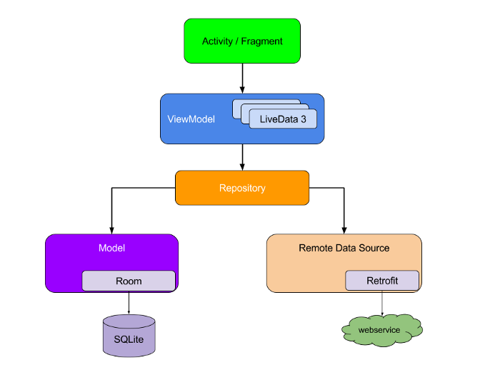

# Popular games

A simple app which will load populair games from the igdb.com API, store it locally and shows a list
to the screen in a RecyclerView. You can click on a game which will navigate you to the
detail fragment.

## Steps

1. Add navigation and Fragments
2. DI with Hilt
3. Add ViewModel
4. Remote data with Retrofit
5. Local storage with Room